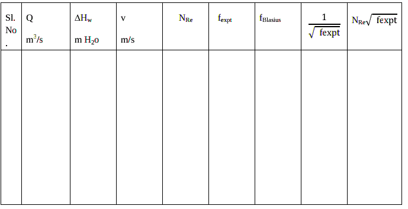

#### Apparatus required :

CCL4 , Hg manometer.

#### Procedure :
 <ol syle="text-align: justify;">
  <li> Keep the valve leading to the smooth pipe open and valves leading to other lines closed.</li>
  <li>Keep the bypass valve completely open and the main valve completely closed. Switch on the pump.</li>
  <li> Connect a CCL4 manometer, to the pressure taps across the smooth pipe. Ensure that no air bubbles present and height in both the limbs of manometer are the same.</li>
<li>Set a flow rate of water through the pipe by opening the main valve and throttling the bypass valve suitably using the rotameter.</li>
<li>Note down the rotameter reading and manometer reading after a steady state is attained.</li>
  <li>Increase the flow rate of water by opening the main valve and throttling the bypass valve suitably and repeat step 4 and 5.</li>
<li> Use mercury manometer for higher flow rates.</li>
  <li>Take eight readings with CCL4 manometer as well as with Hg manometer.</li>
</ol>

##### Data :
Diameter of the pipe= D =
&nbsp;&nbsp;&nbsp;&nbsp;&nbsp;&nbsp;&nbsp;m 
Length of the pipe= L = &nbsp;&nbsp;&nbsp;&nbsp;&nbsp;&nbsp;&nbsp;m 
Density of water =</img>=&nbsp;&nbsp;&nbsp;&nbsp;&nbsp;&nbsp;&nbsp; kg/m3 
Viscosity of water = </img> =cp=&nbsp;&nbsp;&nbsp;&nbsp;&nbsp;&nbsp;&nbsp;kg/ms 
Density of CCl4 = 1600 kg/m3 

Density of Hg = 13600 kg/m3 

##### Observations :

<table >
  <tr>
    <th rowspan="2">Sl No. </th>
    <th rowspan="2">Rotameter reading LPM  </th>
    <th height="53">Manometer reading </th>
  </tr>
  <tr>
    <td height="53"><math xmlns="http://www.w3.org/1998/Math/MathML"><mo>&#8710;</mo></math>Hm cm </td>
  </tr>
  <tr>
    <td height="293"></td>
    <td></td>
    <td></td>
  </tr>
</table>

##### Calculations :

 <ol>
  <li>∆Hm is cm of manometric fluid</li>
  <li>Volumetric flow rate, Q = m3/s</li>
  <li>Pressure drop in m of water </img></li>
  <li> Cross sectional area of the pipe A =</img></li>
  <li>Average velocity through the pipe = V=Q/A  = m/s</li>
  <li> Reynolds number = NRe =</img>=</li>
  <li>Friction factor f is calculated using f Blasius equation: </img></li>
  <li>Friction factor</img></li>
  <li> Nicurdse&rsquo;s correlation:</img></li>
</ol>

</img>

 
Plot fexpt vs NRe on log-log graph. Compare them.  

To verify Nicurdse&rsquo;s correlation:
</img>   
</img> on a semi log graph : 

- Find the slope and intercept. 
- Compare with Nicurdse &rsquo;s correlation. 
- Discuss on effect of Reynolds number on friction factor.

